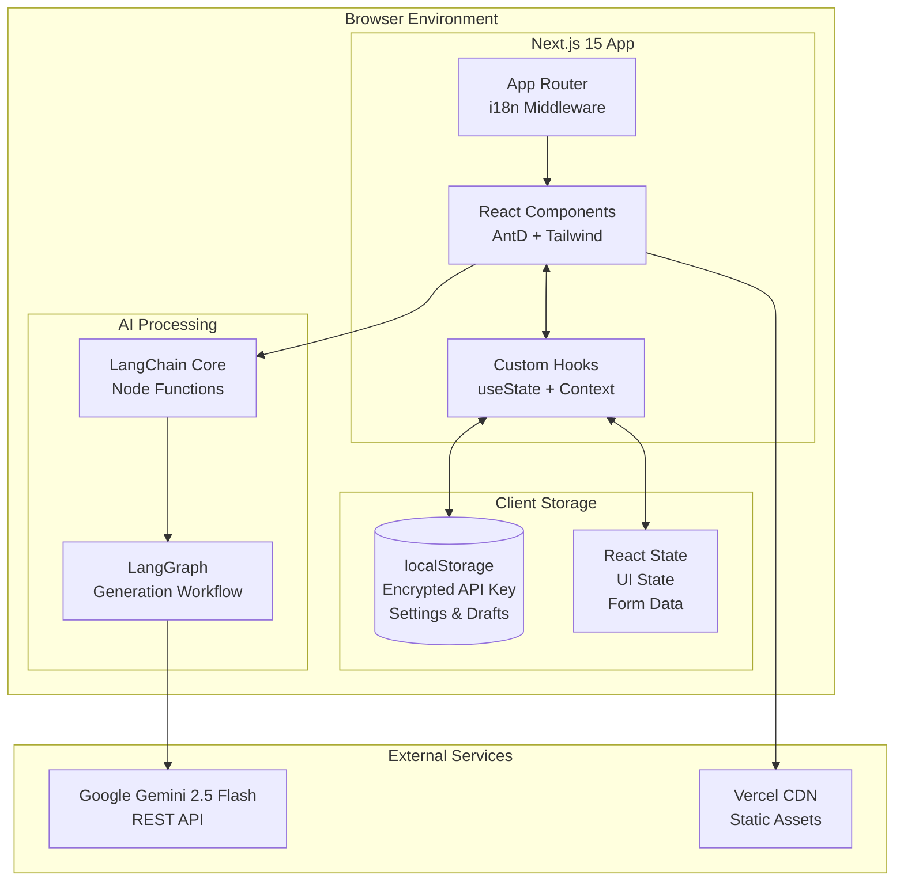
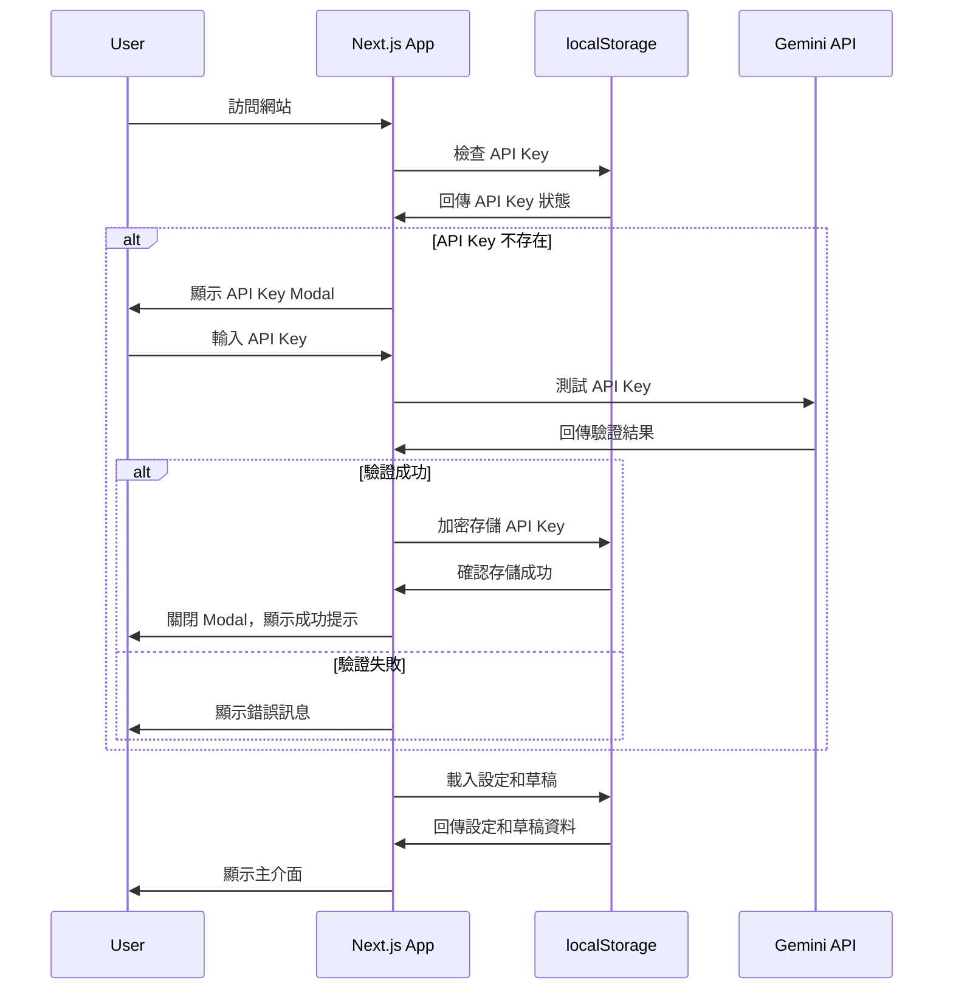
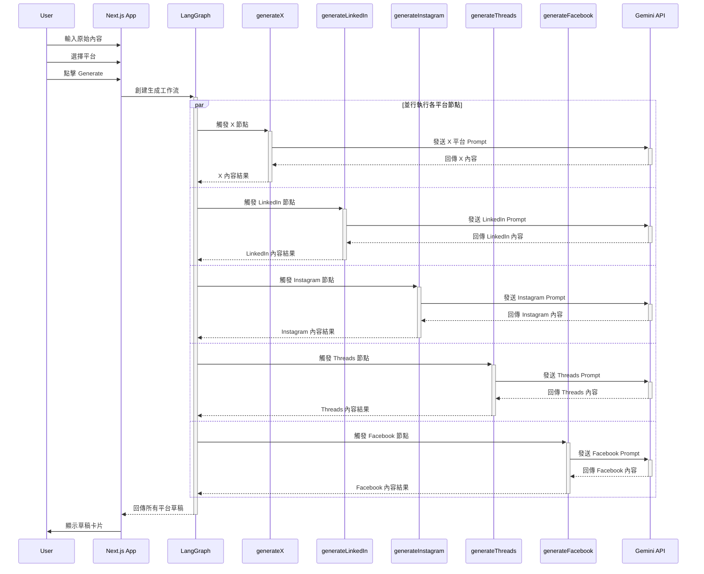
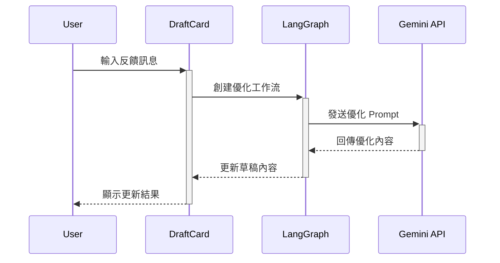
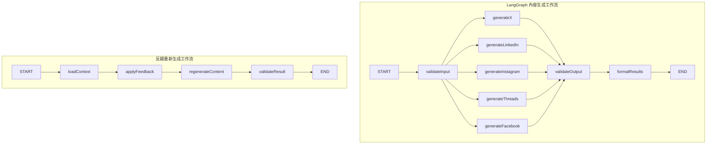

# 社群媒體貼文生成系統設計文檔

## System Design Document for Social-Media Post Generator (Gemini 2.5 Flash)

### 目錄 / Table of Contents

1. [系統概述 / System Overview](#系統概述--system-overview)
2. [技術架構 / Technical Architecture](#技術架構--technical-architecture)
3. [功能需求 / Functional Requirements](#功能需求--functional-requirements)
4. [資料模型 / Data Models](#資料模型--data-models)
5. [系統架構圖 / System Architecture Diagram](#系統架構圖--system-architecture-diagram)
6. [API 流程圖 / API Flow Diagrams](#api-流程圖--api-flow-diagrams)
7. [前端介面設計 / Front-end Interface Design](#前端介面設計--front-end-interface-design)
8. [組件規格 / Component Specifications](#組件規格--component-specifications)
9. [程式庫結構 / Repository Layout](#程式庫結構--repository-layout)
10. [實作細節 / Implementation Details](#實作細節--implementation-details)

## 系統概述 / System Overview

使用者貼上原始內容 → 勾選平台 (X / LinkedIn / Instagram / Threads / Facebook) → **一次呼叫 Gemini 2.5 Flash 生成一到五張草稿卡** → 卡片內可用自然語言回饋並重新生成 → 匯出或複製。
所有邏輯與狀態存放在瀏覽器 (`localStorage`)；不涉及伺服器或資料庫。

**核心價值主張：**
- 零伺服器成本的純前端解決方案
- 一次生成多平台適配內容
- 用戶數據完全本地化，保護隱私
- 自然語言反饋機制優化內容

## 技術架構 / Technical Architecture

| Layer        | 選用技術                                                                                                                                 | 對應 `package.json`         | 版本要求     |
|--------------|--------------------------------------------------------------------------------------------------------------------------------------|---------------------------|----------|
| **前端**       | **Next 15** (`next dev --turbopack`)<br>React 18 + **TypeScript 5**                                                                  | `"next": "15.3.5"`        | >=15.0.0 |
| **UI 組件**    | **Ant Design 5** (`antd` + `@ant-design/icons`)                                                                                      | `"antd": "^5.26.4"`       | >=5.20.0 |
| **樣式**       | **Tailwind CSS 4**（公用 layout spacing / color utilities）<br>AntD Token 變數串接 Tailwind config                                           | `"tailwindcss": "^4"`     | >=4.0.0  |
| **AI / LLM** | **LangChain Core 0.3.x** + **LangGraph 0.3.x**<br>模型：**Gemini 2.5 Flash** (REST API)<br>使用 `Annotation.Root` 定義狀態，`StateGraph` 建構工作流 | `@langchain/*` packages   | >=0.3.0  |
| **國際化**      | **next-intl 4**（資料夾 `/i18n`）                                                                                                         | `"next-intl": "^4.3.4"`   | >=4.0.0  |
| **狀態 / 儲存**  | React `useState` + Context；**localStorage** 持久化（自訂 hook）                                                                             | 無額外 state lib             | -        |
| **工具函數**     | **lodash-es**（debounce, throttle 等工具函數）                                                                                              | `"lodash-es": "^4.17.21"` | >=4.17.0 |
| **部署**       | Vercel 靜態站點 (SSG) 或任意靜態主機                                                                                                            | 不依賴 Node backend          | -        |

## 功能需求 / Functional Requirements

### 核心功能模組

| 模組              | 主要行為                                                                                   | 優先級 | 估時 |
|-----------------|----------------------------------------------------------------------------------------|-----|----|
| **API Key 管理**  | 首次進站彈出 AntD `Modal` 要求輸入 Google API Key → 加密後寫入 `localStorage`。Drawer 內可重新編輯 or 移除。    | P0  | 1d |
| **貼文生成**        | 選平台 → Generate → 同步呼叫 LangGraph 流程一次產出五平台草稿。                                           | P0  | 3d |
| **全域設定 Drawer** | AntD `Drawer` + `Form`: Tone、Length、Hashtag Toggle、Emoji Toggle、CTA。設值快取 localStorage。 | P1  | 2d |
| **卡片級微調**       | 每張卡片右上角 AntD `Dropdown` 提供：Hashtag On/Off、Emoji On/Off、Tone (三色 Chips)。                | P1  | 2d |
| **聊天回饋**        | 卡片底部 AntD `Comment` 組件；送出後觸發單卡重新生成 (LangGraph 子流程)。                                    | P1  | 2d |
| **匯出**          | AntD `FloatButton.Group`：Copy All（拼接純文字）、Download CSV。                                 | P2  | 1d |

### 功能詳細規格

#### 1. API Key 管理
- **觸發時機：** 首次訪問或 localStorage 無有效 key
- **驗證機制：** 調用 Gemini API 測試連通性
- **安全性：** 使用 Web Crypto API 加密存儲
- **錯誤處理：** 顯示具體錯誤信息（配額不足、無效 key 等）

#### 2. 平台適配規則
| 平台          | 字數限制     | 特色功能      | Hashtag 策略  |
|-------------|----------|-----------|-------------|
| X (Twitter) | 280 字符   | 支持 thread | 1-3 個相關標籤   |
| LinkedIn    | 3000 字符  | 專業語調      | 3-5 個行業標籤   |
| Instagram   | 2200 字符  | 視覺導向      | 10-15 個流行標籤 |
| Threads     | 500 字符   | 對話式       | 2-4 個社群標籤   |
| Facebook    | 63206 字符 | 故事性       | 1-3 個廣泛標籤   |

## 資料模型 / Data Models

### 常數定義

```typescript
// 平台枚舉 - constants/platforms.ts
export const PLATFORMS = {
  X: 'x',
  LINKEDIN: 'linkedin',
  INSTAGRAM: 'instagram',
  THREADS: 'threads',
  FACEBOOK: 'facebook'
} as const;

// 語調選項 - constants/settings.ts
export const TONES = {
  PROFESSIONAL: 'professional',
  CASUAL: 'casual',
  HUMOROUS: 'humorous'
} as const;

// 長度選項 - constants/settings.ts
export const LENGTHS = {
  SHORT: 'short',
  MEDIUM: 'medium',
  LONG: 'long'
} as const;
```

### TypeScript 接口定義

```typescript
// types/api.d.ts - API 相關類型
export interface GenerateRequest {
  originalContent: string;
  platforms: Platform[];
  globalSettings: GlobalSettings;
  platformOverrides?: Record<Platform, Partial<PlatformSettings>>;
}

export interface ChatMessage {
  id: string;
  content: string;
  timestamp: number;
  isUser: boolean;
}

// types/settings.d.ts - 設定相關類型
export type Platform = typeof PLATFORMS[keyof typeof PLATFORMS];
export type Tone = typeof TONES[keyof typeof TONES];
export type Length = typeof LENGTHS[keyof typeof LENGTHS];

export interface GlobalSettings {
  tone: Tone;
  length: Length;
  includeHashtags: boolean;
  includeEmojis: boolean;
  includeCallToAction: boolean;
  language: 'zh-TW' | 'en';
}

export interface PlatformSettings {
  platform: Platform;
  tone?: Tone;
  includeHashtags?: boolean;
  includeEmojis?: boolean;
}

// types/content.d.ts - 內容相關類型
export interface DraftContent {
  id: string;
  platform: Platform;
  content: string;
  hashtags: string[];
  timestamp: number;
  feedback: ChatMessage[];
  settings: PlatformSettings;
}

// types/storage.d.ts - 儲存相關類型
export interface LocalStorageData {
  apiKey?: string;
  globalSettings: GlobalSettings;
  drafts: DraftContent[];
  lastUpdated: number;
}

// types/index.ts - 類型導出
export type { Platform, Tone, Length, GlobalSettings, PlatformSettings } from './settings';
export type { DraftContent } from './content';
export type { GenerateRequest, ChatMessage } from './api';
export type { LocalStorageData } from './storage';
```

## 系統架構圖 / System Architecture Diagram



## API 流程圖 / API Flow Diagrams

### 1. 初始化流程


### 2. 內容生成流程


### 3. 反饋重新生成流程


## 前端介面設計 / Front-end Interface Design

### 響應式佈局規格

```
Desktop (>1200px):
┌─────────────────────────────────────────────────────────┐
│  Header: Logo + Settings + Language                     │
├─────────────────────────────────────────────────────────┤
│  ComposePanel (Full Width, 300px height)                │
├─────────────────────────────────────────────────────────┤
│  DraftDeck (Horizontal Scroll, 5 cards)                 │
│   ┌─────────┐ ┌─────────┐ ┌─────────┐ ┌─────────┐ ┌───  │
│   │X (原    │ │LinkedIn │ │Instagram│ │Threads  │ │Face │
│   │Twitter) │ │Draft    │ │Draft    │ │Draft    │ │...  │
│   │Draft    │ │         │ │         │ │         │ │     │
│   └─────────┘ └─────────┘ └─────────┘ └─────────┘ └───  │
└─────────────────────────────────────────┬─ ExportBar ───┘
                                          └─ FloatButton ──

Tablet (768px-1200px):
┌─────────────────────────────────────────────────────────┐
│  ComposePanel (Stacked Form)                            │
├─────────────────────────────────────────────────────────┤
│  DraftDeck (2x3 Grid or Horizontal Scroll)              │
└─────────────────────────────────────────────────────────┘

Mobile (<768px):
┌─────────────────┐
│  ComposePanel   │
│  (Compact)      │
├─────────────────┤
│  DraftCard      │
│  (Vertical      │
│   Stack)        │
└─────────────────┘
```

### 色彩系統 (AntD Token + Tailwind)

```typescript
// theme/tokens.ts
export const themeTokens = {
  colorPrimary: '#1677ff',     // 主品牌色
  colorSuccess: '#52c41a',     // 成功狀態  
  colorWarning: '#faad14',     // 警告狀態
  colorError: '#ff4d4f',       // 錯誤狀態
  colorBgContainer: '#ffffff', // 容器背景
  colorBgElevated: '#fafafa',  // 提升背景
  borderRadius: 8,             // 統一圓角
  fontFamily: '"Inter", -apple-system, BlinkMacSystemFont, sans-serif'
};

// 對應 Tailwind classes
// bg-primary -> bg-[#1677ff]
// text-success -> text-[#52c41a]
```

## 組件規格 / Component Specifications

### 1. ApiKeyModal 組件

```typescript
interface ApiKeyModalProps {
  open: boolean;
  onSuccess: (key: string) => void;
  onCancel?: () => void;
}

// 功能需求:
// - 輸入驗證 (格式檢查)
// - API 連通性測試
// - 錯誤狀態顯示
// - Loading 狀態
```

### 2. ComposePanel 組件

```typescript
interface ComposePanelProps {
  onGenerate: (request: GenerateRequest) => Promise<void>;
  loading?: boolean;
}

// 表單字段:
// - originalContent: TextArea (必填, 10-5000 字)
// - platforms: Select Multiple (必選至少1個)
// - 快速設定按鈕組 (Tone/Length)
```

### 3. DraftCard 組件

```typescript
interface DraftCardProps {
  draft: DraftContent;
  onUpdate: (id: string, content: string) => void;
  onFeedback: (id: string, message: string) => Promise<void>;
  onExport: (id: string, format: 'text' | 'json') => void;
}

// 卡片結構:
// - Header: Platform Badge + Quick Settings Dropdown
// - Body: Content Preview (可編輯)
// - Footer: Character Count + Chat Toggle
// - ChatPane: Collapsible feedback section
```

### 4. QuickTweak 組件

```typescript
interface QuickTweakProps {
  settings: PlatformSettings;
  onChange: (settings: PlatformSettings) => void;
  availableOptions: {
    tones: Tone[];
    toggles: ('hashtags' | 'emojis')[];
  };
}

// Dropdown 選項:
// - Tone: Radio Group (Professional/Casual/Humorous)
// - Hashtags: Switch
// - Emojis: Switch  
// - Regenerate: Action Button
```

### 5. ChatPane 組件

```typescript
interface ChatPaneProps {
  messages: ChatMessage[];
  onSendMessage: (content: string) => Promise<void>;
  loading?: boolean;
}

// 聊天功能:
// - 訊息歷史 (最多50條)
// - 輸入框 + 發送按鈕
// - 自動滾動到最新訊息
// - Loading 指示器
```

### 6. ExportBar 組件

```typescript
interface ExportBarProps {
  drafts: DraftContent[];
  onCopyAll: () => void;
  onDownloadCSV: () => void;
  onDownloadJSON: () => void;
}

// 浮動按鈕組:
// - Copy All: 複製所有草稿到剪貼板
// - Download CSV: 匯出表格格式
// - Download JSON: 匯出原始數據
```

## 程式庫結構 / Repository Layout

```
d:\GitHub\social-media-post-assistant/
├── package.json
├── next.config.js
├── tailwind.config.ts
├── tsconfig.json
├── .env.local.example
├── .gitignore
├── README.md
│
├── docs/
│   └── SystemDesign.md
│
├── public/
│
└── src/
    ├── middleware.ts           # next-intl 中間件
    │
    ├── app/
    │   ├── [locale]/
    │   │   ├── layout.tsx      # 本地化佈局
    │   │   ├── page.tsx        # 主頁面 (SPA)
    │   │   ├── globals.css     # 全域樣式
    │   │   └── loading.tsx     # 加載頁面
    │   └── layout.tsx          # 根佈局
    │
    ├── components/
    │   ├── ui/                 # 通用 UI 組件
    │   │   ├── ApiKeyModal/
    │   │   │   ├── index.tsx
    │   │   │   ├── ApiKeyModal.tsx
    │   │   │   └── __tests__/
    │   │   ├── ComposePanel/
    │   │   ├── DraftCard/
    │   │   ├── QuickTweak/
    │   │   ├── ChatPane/
    │   │   ├── ExportBar/
    │   │   └── Layout/
    │   │
    │   └── providers/          # Context Providers
    │       ├── index.tsx
    │       ├── ThemeProvider.tsx
    │       ├── LocaleProvider.tsx
    │       └── DraftStoreProvider.tsx
    │
    ├── constants/              # 常數定義
    │   ├── index.ts            # 常數導出
    │   ├── platforms.ts        # 平台相關常數
    │   ├── generation.ts       # 生成相關常數
    │   └── ui.ts               # UI 相關常數
    │
    ├── hooks/
    │   ├── index.ts            # hooks 工具導出
    │   ├── useApiKey.ts        # API Key 管理
    │   ├── useLocalStorage.ts  # localStorage 工具
    │   ├── useDraftStore.ts    # 草稿狀態管理
    │   ├── useGeneration.ts    # 內容生成邏輯
    │   └── useExport.ts        # 匯出功能
    │
    ├── lib/
    │   ├── gemini/
    │   │   ├── __tests__/      # Jest 功能測試
    │   │   │   └── client.test.ts
    │   │   ├── index.ts        # Gemini API 導出
    │   │   ├── client.ts       # Gemini API 客戶端
    │   │   └── types.ts        # API 類型定義
    │   ├── langchain/
    │   │   ├── __tests__/      # Jest 功能測試
    │   │   │   ├── state.test.ts
    │   │   │   └── graph.test.ts
    │   │   ├── nodes/          # LangGraph 節點獨立檔案
    │   │   │   ├── __tests__/  # 節點測試
    │   │   │   │   ├── validateInput.test.ts
    │   │   │   │   ├── generateX.test.ts
    │   │   │   │   ├── generateLinkedIn.test.ts
    │   │   │   │   ├── generateInstagram.test.ts
    │   │   │   │   ├── generateThreads.test.ts
    │   │   │   │   ├── generateFacebook.test.ts
    │   │   │   │   ├── validateOutput.test.ts
    │   │   │   │   └── formatResults.test.ts
    │   │   │   ├── validateInput.ts    # 輸入驗證節點
    │   │   │   ├── generateX.ts        # X平台生成節點 (含prompt)
    │   │   │   ├── generateLinkedIn.ts # LinkedIn生成節點 (含prompt)
    │   │   │   ├── generateInstagram.ts# Instagram生成節點 (含prompt)
    │   │   │   ├── generateThreads.ts  # Threads生成節點 (含prompt)
    │   │   │   ├── generateFacebook.ts # Facebook生成節點 (含prompt)
    │   │   │   ├── validateOutput.ts   # 輸出驗證節點
    │   │   │   ├── formatResults.ts    # 結果格式化節點
    │   │   │   └── index.ts           # 節點導出
    │   │   ├── index.ts        # LangGraph 工作流程導出
    │   │   ├── state.ts        # LangGraph 狀態管理
    │   │   └── graph.ts        # LangGraph 工作流
    │   ├── storage/
    │   │   ├── __tests__/      # Jest 功能測試
    │   │   │   ├── encryption.test.ts
    │   │   │   └── persistence.test.ts
    │   │   ├── index.ts        # 儲存工具導出
    │   │   ├── encryption.ts   # 加密工具
    │   │   └── persistence.ts  # 持久化邏輯
    │   └── utils/
    │       ├── __tests__/      # Jest 功能測試
    │       │   ├── validation.test.ts
    │       │   ├── export.test.ts
    │       │   └── formatting.test.ts
    │       ├── index.ts        # 工具函數導出
    │       ├── validation.ts   # 驗證函數
    │       ├── export.ts       # 匯出工具
    │       └── formatting.ts   # 格式化工具
    │
    ├── i18n/
    │   ├── locales/
    │   │   ├── zh-TW.json
    │   │   └── en.json
    │   └── index.ts            # i18n 導出
    │
    └── types/
        ├── index.ts            # 類型導出
        ├── api.d.ts            # API 相關類型
        ├── settings.d.ts       # 設定相關類型
        ├── content.d.ts        # 內容相關類型
        ├── storage.d.ts        # 儲存相關類型
        └── next-intl.d.ts      # next-intl 類型增強
```

## 開發規範 / Development Standards

### 1. 檔案命名與結構規範

#### Index 檔案規範
- 所有 `index.ts` 檔案僅用於導出 (export)，不進行任何宣告或實作
- React 組件目錄使用 `index.tsx` 進行導出，因為可能包含 JSX 語法
- 使用 barrel exports 統一導出模組內容
- 按字母順序排列導出項目
- 類型定義應在專門的 `.d.ts` 檔案中宣告，再透過 `index.ts` 導出

```typescript
// ✅ 正確示例 - lib/utils/index.ts (純邏輯導出)
export { validateInput } from './validation';
export { exportToCSV, exportToJSON } from './export';
export { formatContent } from './formatting';

// ✅ 正確示例 - components/ui/ApiKeyModal/index.tsx (React 組件導出)
export { ApiKeyModal } from './ApiKeyModal';

// ✅ 正確示例 - types/index.ts (類型導出)
export type { Platform, Tone, Length } from './settings';
export type { DraftContent } from './content';
export type { GenerateRequest } from './api';

// ❌ 錯誤示例 - 不應在 index.ts 中宣告
export const DEFAULT_SETTINGS = { ... };
export interface UserSettings { ... };
```

#### 類型定義規範
- 類型定義檔案使用 `.d.ts` 尾綴
- 類型定義檔案不應包含任何定值 (constants)
- 純類型宣告，不包含實作邏輯

```typescript
// ✅ 正確示例 - types/index.d.ts
export interface GlobalSettings {
  tone: string;
  length: string;
  includeHashtags: boolean;
}

// ❌ 錯誤示例 - 不應在 .d.ts 中定義定值
export const DEFAULT_TONE = 'professional';
```

#### 常數定義規範
- 所有常數定義在 `constants/` 目錄
- 使用大寫加底線命名 (UPPER_SNAKE_CASE)
- 按功能模組分組

```typescript
// ✅ 正確示例 - constants/platforms.ts
export const PLATFORM_LIMITS = {
  X: 280,
  LINKEDIN: 3000,
  INSTAGRAM: 2200,
  THREADS: 500,
  FACEBOOK: 63206
} as const;

export const DEFAULT_GLOBAL_SETTINGS = {
  TONE: 'professional',
  LENGTH: 'medium',
  INCLUDE_HASHTAGS: true,
  INCLUDE_EMOJIS: true,
  INCLUDE_CALL_TO_ACTION: false,
  LANGUAGE: 'zh-TW'
} as const;
```

### 2. 程式碼組織規範

#### 導入順序
1. Node 內建模組
2. 第三方套件
3. 內部模組 (使用 @/ 別名)
4. 類型導入最後，並且使用 `import type` 來避免引入實作

```typescript
// ✅ 正確示例
import { StateGraph, Annotation } from "@langchain/langgraph";

import { geminiClient } from '@/lib/gemini/client';
import { PLATFORM_LIMITS } from '@/constants/platforms';
import type { GenerationState, Platform } from '@/types';
```

#### 路徑別名規範
- 使用 `@/` 代表 `src/` 目錄
- 優先使用別名路徑，避免相對路徑 `../`
- 保持導入路徑一致性
- 若模組有 `index.ts` 或 `index.tsx` 導出，應從模組目錄導入，不直接導入檔案
- React 組件統一從組件目錄導入（通過 `index.tsx`）

```typescript
// ✅ 正確示例
import { DEFAULT_LANGUAGE } from '@/i18n';
import { DraftCard } from '@/components/ui/DraftCard'; // 從 DraftCard/index.tsx 導出
import { useApiKey } from '@/hooks'; // 從 hooks/index.ts 導出
import { PLATFORMS } from '@/constants'; // 從 constants/index.ts 導出

// ❌ 錯誤示例
import { DEFAULT_LANGUAGE } from '../../i18n';
import { DraftCard } from '../ui/DraftCard/DraftCard'; // 不直接導入檔案
import { useApiKey } from '../../hooks/useApiKey'; // 不直接導入檔案
import { PLATFORMS } from '../../constants/platforms'; // 不直接導入檔案
```

#### 函數規範
- 使用 camelCase
- 動詞開頭，語義清晰
- 避免縮寫
- 禁止使用 `any` 類型

```typescript
// ✅ 正確示例
export const generateXContent = async (state: GenerationState) => { ... };
export const validateUserInput = (input: string) => { ... };

// ❌ 錯誤示例
export const genX = async (s: any) => { ... };
export const validate = (i: string) => { ... };
```

## 實作細節 / Implementation Details

### 1. LangGraph 工作流設計

```typescript
// lib/langchain/graph.ts
import { StateGraph, Annotation, START, END } from "@langchain/langgraph";
import { 
  validateInput,
  generateXContent,
  generateLinkedInContent,
  generateInstagramContent,
  generateThreadsContent,
  generateFacebookContent,
  validateOutput,
  formatResults
} from '@/lib/langchain/nodes';

// 使用 Annotation 定義狀態結構
export const GenerationState = Annotation.Root({
  originalContent: Annotation<string>(),
  platforms: Annotation<Platform[]>(),
  globalSettings: Annotation<GlobalSettings>(),
  drafts: Annotation<Record<Platform, string>>({
    default: () => ({} as Record<Platform, string>),
    reducer: (left, right) => ({ ...left, ...right })
  }),
  errors: Annotation<Record<Platform, string>>({
    default: () => ({} as Record<Platform, string>),
    reducer: (left, right) => ({ ...left, ...right })
  }),
});

// 工作流圖建構 - 每個平台獨立節點
export const contentGenerationGraph = new StateGraph(GenerationState)
  .addNode("validateInput", validateInput)
  .addNode("generateX", generateXContent)
  .addNode("generateLinkedIn", generateLinkedInContent)
  .addNode("generateInstagram", generateInstagramContent)
  .addNode("generateThreads", generateThreadsContent)
  .addNode("generateFacebook", generateFacebookContent)
  .addNode("validateOutput", validateOutput)
  .addNode("formatResults", formatResults)
  .addEdge(START, "validateInput")
  .addEdge("validateInput", "generateX")
  .addEdge("validateInput", "generateLinkedIn")
  .addEdge("validateInput", "generateInstagram")
  .addEdge("validateInput", "generateThreads")
  .addEdge("validateInput", "generateFacebook")
  .addEdge("generateX", "validateOutput")
  .addEdge("generateLinkedIn", "validateOutput")
  .addEdge("generateInstagram", "validateOutput")
  .addEdge("generateThreads", "validateOutput")
  .addEdge("generateFacebook", "validateOutput")
  .addEdge("validateOutput", "formatResults")
  .addEdge("formatResults", END)
  .compile();
```

### 2. 節點檔案結構範例

```typescript
// lib/langchain/nodes/generateX.ts
import { geminiClient } from '../../gemini/client';
import { GenerationState } from '../state';
import { Platform } from '../../../types';

const X_PROMPT = `
  作為社群媒體專家，請將以下內容改寫為適合 X (原 Twitter) 的貼文：
  原始內容：{originalContent}
  
  要求：
  - 限制在 280 字符以內
  - 語調：{tone}
  - 長度：{length}
  - 包含話題標籤：{includeHashtags}
  - 包含表情符號：{includeEmojis}
  
  請直接回傳貼文內容，不要包含其他說明。
`;

export const generateXContent = async (state: typeof GenerationState.State) => {
  if (!state.platforms.includes(Platform.X)) return {};
  
  try {
    const prompt = X_PROMPT
      .replace('{originalContent}', state.originalContent)
      .replace('{tone}', state.globalSettings.tone)
      .replace('{length}', state.globalSettings.length)
      .replace('{includeHashtags}', state.globalSettings.includeHashtags.toString())
      .replace('{includeEmojis}', state.globalSettings.includeEmojis.toString());
      
    const response = await geminiClient.generateContent(prompt);
    return { drafts: { [Platform.X]: response.text() } };
  } catch (error) {
    return { errors: { [Platform.X]: error.message } };
  }
};
```

### 3. 錯誤處理策略

```typescript
// lib/utils/errorHandling.ts
export enum ErrorType {
  API_KEY_INVALID = 'API_KEY_INVALID',
  QUOTA_EXCEEDED = 'QUOTA_EXCEEDED', 
  NETWORK_ERROR = 'NETWORK_ERROR',
  CONTENT_TOO_LONG = 'CONTENT_TOO_LONG',
  GENERATION_FAILED = 'GENERATION_FAILED'
}

export interface AppError {
  type: ErrorType;
  message: string;
  details?: any;
  timestamp: number;
}

// 錯誤恢復機制:
// - API 限流：指數退避重試
// - 網路錯誤：自動重試 3 次
// - 內容生成失敗：提供預設模板
```

### 4. 性能優化策略

```typescript
// hooks/useDraftStore.ts
import { useMemo, useCallback } from 'react';
import { debounce } from 'lodash-es';

export const useDraftStore = () => {
  const [drafts, setDrafts] = useState<DraftContent[]>([]);

  // 防抖存儲到 localStorage
  const debouncedSave = useMemo(
    () => debounce((data: LocalStorageData) => {
      localStorage.setItem('drafts', JSON.stringify(data));
    }, 1000),
    []
  );

  // 記憶化計算
  const draftsByPlatform = useMemo(() => {
    return drafts.reduce((acc, draft) => {
      acc[draft.platform] = draft;
      return acc;
    }, {} as Record<Platform, DraftContent>);
  }, [drafts]);

  // 內容生成邏輯
  const generateContent = useCallback(async (request: GenerateRequest) => {
    try {
      // 調用 LangGraph 工作流
      const result = await contentGenerationGraph.invoke({
        originalContent: request.originalContent,
        platforms: request.platforms,
        globalSettings: request.globalSettings,
        drafts: {},
        errors: {}
      });
      
      // 更新草稿狀態
      const newDrafts = Object.entries(result.drafts).map(([platform, content]) => ({
        id: generateId(),
        platform: platform as Platform,
        content,
        hashtags: extractHashtags(content),
        timestamp: Date.now(),
        feedback: [],
        settings: request.platformOverrides?.[platform as Platform] || {}
      }));
      
      setDrafts(newDrafts);
      debouncedSave({ drafts: newDrafts, globalSettings: request.globalSettings, lastUpdated: Date.now() });
    } catch (error) {
      console.error('Content generation failed:', error);
    }
  }, [debouncedSave]);

  return {
    drafts,
    draftsByPlatform,
    generateContent,
    // ... 其他方法
  };
};
```

### 5. 安全性實作

```typescript
// lib/storage/encryption.ts
export class SecureStorage {
  private static async generateKey(): Promise<CryptoKey> {
    return await crypto.subtle.generateKey(
      { name: 'AES-GCM', length: 256 },
      false,
      ['encrypt', 'decrypt']
    );
  }

  static async encryptApiKey(apiKey: string): Promise<string> {
    // 使用 Web Crypto API 加密 API Key
    // 返回 base64 編碼的加密字串
  }

  static async decryptApiKey(encryptedKey: string): Promise<string> {
    // 解密 API Key
  }
}
```

## LangGraph 工作流圖 / LangGraph Workflow Diagram


